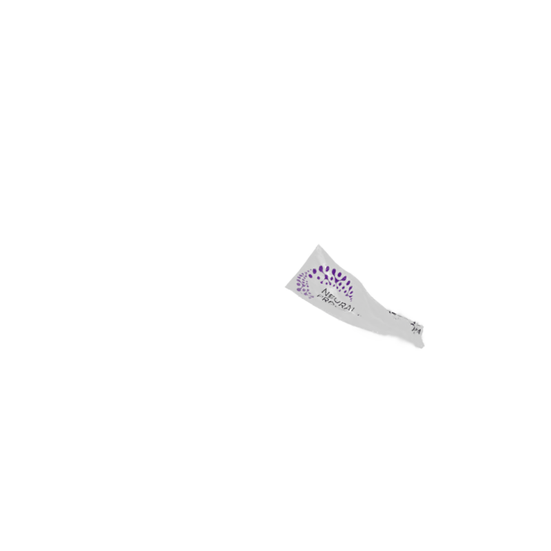
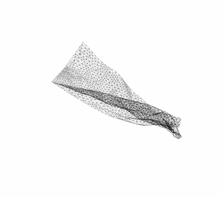
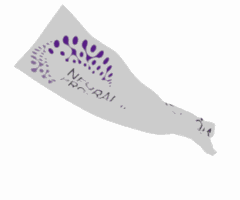
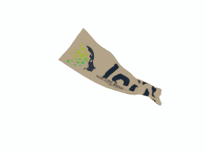
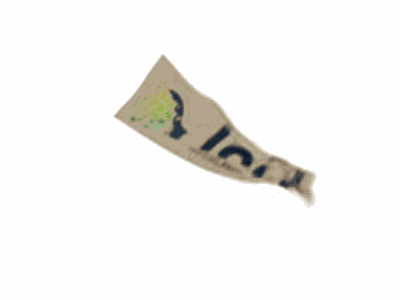
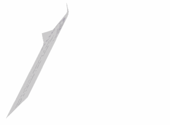
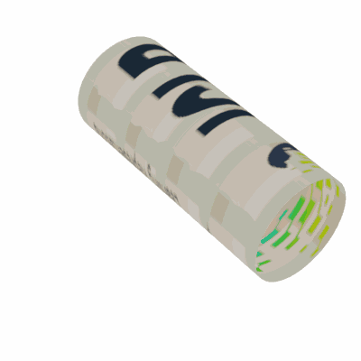
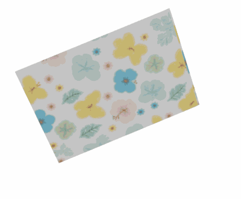

# CloDS: Visual-Only Unsupervised Cloth Dynamics Learning in Unknown Conditions
## 1. Visualization of the learned dynamics (Visuallization of Figure 5)
<table>
  <tr>
    <td align="center">
       
      <strong>Ground Truth</strong>
    </td>
    <td align="center">
       
      <strong>CloDS (ours)</strong>
    </td>
  </tr>
</table>
<table>
  <tr>
    <td align="center">
       
      <strong>Ground Truth Mesh</strong>
    </td>
    <td align="center">
       
      <strong>CloDS Mesh (ours)</strong>
    </td>
  </tr>
</table>
<table>
  <tr>
    <td align="center">
       
      <strong>TAU</strong>
    </td>
    <td align="center">
       
      <strong>MMVP</strong>
  </tr>
</table>
<table>
  <tr>
    <td align="center">
       
      <strong>SimVP (gSTA)</strong>
    </td>
    <td align="center">
       
      <strong>SimVP (IncepU)</strong>
    </td>
  </tr>
</table>
<table>
  <tr>
    <td align="center">
       
      <strong>MAU</strong>
    </td>
  </tr>
</table>

## 2. Visualization of the ablation studies in SMGS (Visualization of Figure 3)
<table>
  <tr>
    <td align="center">
       
      <strong>Ground Truth</strong>
    </td>
    <td align="center">
       
      <strong>SMGS (ours)</strong>
    </td>
  </tr>
</table>
<table>
  <tr>
    <td align="center">
       
      <strong> GaMes (w/o $\mu^W$)</strong>
    </td>
    <td align="center">
       
      <strong>w/o mesh (w/o $\mu^M$)</strong>
    </td>
  </tr>
</table>

## 3. Generalization to Shape (Visualization of Figure 6a)
<table>
  <tr>
    <td align="center">
       
      <strong> Ground Truth </strong>
    </td>
    <td align="center">
       
      <strong>CloDS (ours)</strong>
    </td>
  </tr>
</table>

## 4. Generalization Texture (Visualization of Figure 6b)
<table>
  <tr>
    <td align="center">
       
      <strong> Ground Truth </strong>
    </td>
    <td align="center">
       
      <strong>CloDS (ours)</strong>
    </td>
  </tr>
</table>

## 5. Real-world Experiments (Visualization of Figure 6c)
<table>
  <tr>
    <td align="center">
       
      <strong> Ground Truth </strong>
    </td>
    <td align="center">
       
      <strong>Ground Truth (SAM)</strong>
    </td>
      <td align="center">
       
      <strong>CloDS (ours)</strong>
    </td>
  </tr>
</table>

## 6. Performance under Lighting Conditions (Visualization of Figure S.3 in Appendix H.5)
<table>
  <tr>
    <td align="center">
       
      <strong>Reference (Rended)</strong>
    </td>
    <td align="center">
       
      <strong>Reference (Mesh)</strong>
    </td>
    <td align="center">
       
      <strong>CloDS (ours)</strong>
    </td>
  </tr>
</table>

## 7. The result of sora (Visualization of Appendix H.8)
<table>
  <tr>
    <td align="center">
       
      <strong>The result of sora. Prompt: 'A flag fluttering in the wind'.</strong>
    </td>
    <td align="center">
       
      <strong>CloDS (ours)</strong>
    </td>
  </tr>
</table>

## 8. Visualization of geometry-aware approaches. (Figure 9a, Reviewer FVhY)
<table>
  <tr>
    <td align="center">
       
      <strong>Ground Truth</strong>
    </td>
    <td align="center">
       
      <strong>CloDS (ours)</strong>
    </td>
  </tr>
</table>

<table>
  <tr>
    <td align="center">
       
      <strong>CS</strong>
    </td>
    <td align="center">
       
      <strong>LIP</strong>
    </td>
  </tr>
</table>

## 9. Visualization of object-cloth collision. (Figure 9b, Reviewer bT4z)

<table>
  <tr>
    <td align="center">
       
      <strong>Ground Truth</strong>
    </td>
    <td align="center">
       
      <strong>CloDS (ours)</strong>
    </td>
  </tr>
</table>

## 10. Visualization of Real-world garmen. (Figure 9c, Reviewer kW74 and FVhY)
### 10.1 Pants
<table>
  <tr>
    <td align="center">
       
      <strong>Ground Truth</strong>
    </td>
    <td align="center">
       
      <strong>CloDS (ours)</strong>
    </td>
  </tr>
</table>

### 10.2 Dress
<table>
  <tr>
    <td align="center">
       
      <strong>Ground Truth</strong>
    </td>
    <td align="center">
       
      <strong>CloDS (ours)</strong>
    </td>
  </tr>
</table>

## 11. Visualization of CDR under different noise conditions. (Figure S.2 in Appendix E, Reviewer FVhY)
<table>
  <tr>
    <td align="center">
       
      <strong>Ground Truth</strong>
    </td>
    <td align="center">
       
      <strong>CloDS (ours)</strong>
    </td>
  </tr>
</table>

<table>
  <tr>
    <td align="center">
       
      <strong>Gaussian noise</strong>
    </td>
    <td align="center">
       
      <strong>Translation noise</strong>
    </td>
  </tr>
</table>
<table>
  <tr>
    <td align="center">
       
      <strong>Scaling noise</strong>
    </td>
  </tr>
</table>

## 12. Visualization of Extracted mesh. (Figure S.5 in Appendix H.4, Reviewer FVhY)

<table>
  <tr>
    <td align="center">
       
      <strong>Ground Truth Mesh</strong>
    </td>
    <td align="center">
       
      <strong>Extracted Mesh (CloDS)</strong>
    </td>
  </tr>
</table>

<table>
  <tr>
    <td align="center">
       
      <strong>Predicted Mesh (CloDS)</strong>
    </td>
    <td align="center">
       
      <strong>Extracted Mesh (w/o $\mathcal{L}_{edge}$)</strong>
    </td>
  </tr>
</table>

